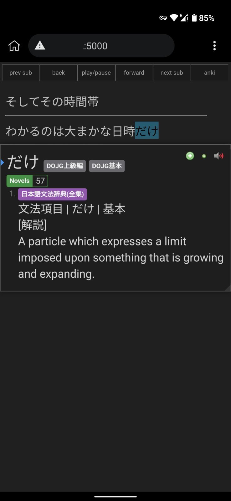

# mpv-sub-streamer

Streams subtitles into a webpage. Made possible by [mpvacious](https://github.com/Ajatt-Tools/mpvacious) copying subtitles into the clipboard. Also, offers basic remote playback control and the possibility to add the subtitle media to the last added Anki card. 

1. Start server on playing device.
2. Open page on your phone with [KiwiBrowser](https://github.com/kiwibrowser/src.next) + Yomichan.
3. Start video on playing device.

```bash
python main.py 0.0.0.0:5000
```

### # Controls
* previous subtitle
* back
* play/pause
* forward
* next subtitle
* anki: 
  * adds subtitle media clip to the last added Anki card
  * **only works if Yomichan is connected to the playing device's AnkiConnect.**

### # Requirements
* `pip install Flask pyautogui flask-sock`
* [mpvacious](https://github.com/Ajatt-Tools/mpvacious)
  * subs2srs.conf: `autoclip=yes`
* xclip (clipboard)
* tkinter (remote control with hotkeys)
* AnkiConnect*

### # Screenshot


